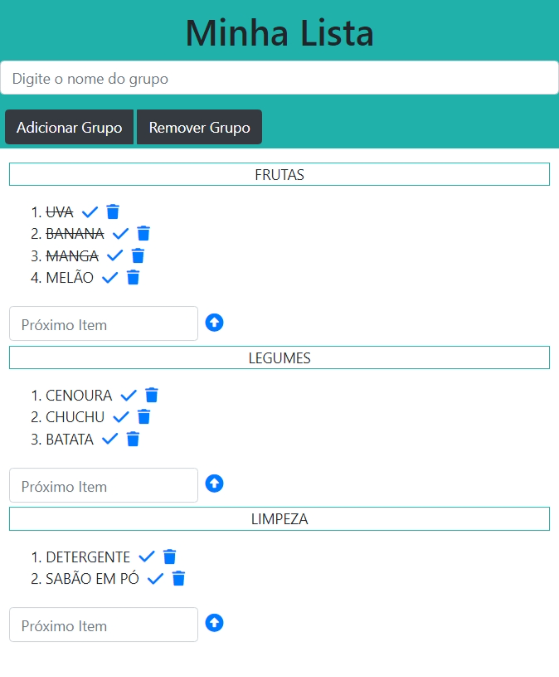

# Market_List
 Lista de Mercado

[Acesse aqui Market_List](https://paulovitorguedes-marketlist.netlify.app/)
#### Projeto em *HTML*, *CSS*, *BOOTSTRAP* e *JAVASCRIPT*

Um projeto desafiador, sem a utilização de banco de dados.  
O Market_list foi projetado para criação de lista de mercado e auxiliando em suas compras.

___

- Adicionar Grupos.  
Digite o nome do grupo no local indicado no topo da página.  
Clique no botão "Adicionar Grupo".  
Adicione quantos grupos for necessário.  

- Remover Grupo.  
Digite o nome do grupo no local indicado no topo da página.  
Clique no botão "Remover Grupo".  
O Grupo apenas poderá ser remevido caso não contenha itens.  

- Adicionar Itens.  
Digite o nome do item no local indicado "Próximo Item".  
Clique no icone seta UP.  
Adicione quantos itens for necessário.  

- Remover Itens.  
Para remover um item, clique no icone lixeira ao lado do item desejado.  

- Riscar Itens.  
Para riscar um item, clique no icone check ao lado do item desejado.  
Ao clicar novamente no icone check, o riscado no item desejado será removido.